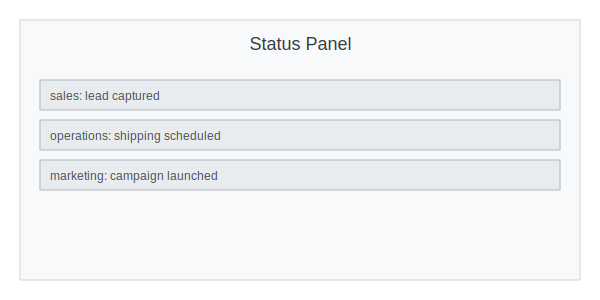

<!-- README.md -->

# 🚀 Brookside BI – Autonomous Sales & Marketing Agents

[](https://github.com/BrooksideBI/portfolio/actions/workflows/ci.yml)
[](LICENSE)

Welcome to the Brookside BI Agentic System! This repo contains a modular, turn-based framework of specialized AI “expert” agents that power everything from lead capture to contract delivery, all orchestrated under a central Orchestrator agent. Whether you’re adding a new campaign agent or tweaking your CRM integration, you’ll find a clean separation of concerns that makes extending and testing your workflow a breeze. A lightweight `crm_connector` module now fetches deals directly from your CRM using `CRM_API_URL` and `CRM_API_KEY`.

For a deeper explanation of the architecture—including the event bus, memory service and how AutoGen teams are loaded and how teams start running—see [docs/architecture.md](docs/architecture.md).

## ⚡ Quick Start

This project supports **Python 3.9, 3.10 and 3.11**. All three versions are
tested automatically in CI so you can develop with confidence on any of them.

Install the requirements, set up pre-commit hooks and run the unit tests to verify your environment:

```bash
pip install -r requirements.txt
pip install pre-commit
pre-commit install
mypy .
pytest -q
```

You can exercise the orchestrator with a single team using a few lines of Python:

```python
from src.solution_orchestrator import SolutionOrchestrator

orch = SolutionOrchestrator({"sales": "src/teams/sales_team_full.json"})
orch.handle_event("sales", {"type": "lead_capture", "payload": {"email": "alice@example.com"}})
```

---

## 🔍 What’s Inside

```
├── src/
│   ├── agents/                # Core agent implementations
│   ├── tools/                 # Reusable utilities used by agents
│   ├── config.py             # Env vars & API keys
│   ├── orchestrator.py        # Event bus wiring
│   ├── crm_connector.py       # Basic CRM API connector
│   ├── dev_assist.py          # Boilerplate generator
│   ├── debugger_agent.py      # Auto patch suggestions
│   ├── qa_agent.py            # Conversation tester
│   └── teams/                 # RoundRobinGroupChat definitions
├── tests/                     # pytest suite
└── README.md                  # You are here!
```

The `tools` package contains submodules for CRM integrations, email and doc generation, ad campaign helpers and more. Each agent has a corresponding unit test under `tests/`.

### 🏡 Real Estate Expansion

A new `Real Estate Team` demonstrates how the framework can be adapted for other industries. It bundles agents for finding leads, pulling MLS data, creating listings and posting them to major portals. See `src/teams/real_estate_team.json` for the configuration and the accompanying tools under `src/tools/real_estate_tools`.

### 🚚 Operations & Fulfillment Teams

Several additional JSON configs showcase logistics workflows. New teams cover warehouse operations, inventory management, order fulfillment, driver tracking and e-commerce. These rely on the tools in `src/tools/operations_tools` and `src/tools/ecommerce_tool.py` for TMS, inventory and shopping cart integrations along with Microsoft Teams notifications.

### 🚧 Building Modular AutoGen Teams

The JSON files under `src/teams/` showcase how to wire multiple agents together
using [AutoGen](https://github.com/microsoft/autogen). Each file describes a
`RoundRobinGroupChat` with a list of **participants** and optional tools. To
create a new industry workflow:

1. Copy one of the existing team JSONs and update the `participants` section
   with your agents.
2. Add `FunctionTool` entries for any custom business logic your agents need.
3. Adjust the termination conditions (for example `MaxMessageTermination`) to
   control when the team conversation stops.

By editing these declarative configs you can quickly deploy specialised agent
teams for finance, healthcare, manufacturing or any other domain without
changing the core orchestrator code.

A trimmed example from `sales_team_full.json` looks like:

```json
{
  "provider": "autogen.agentchat.teams.RoundRobinGroupChat",
  "config": {
    "participants": [
      {"provider": "src.agents.roles.AssistantAgent", "config": {"name": "orchestrator_agent"}},
      {"provider": "src.agents.roles.AssistantAgent", "config": {"name": "lead_agent"}}
    ],
    "tools": [
      {"provider": "src.tools.crm_tool.CRMTool"}
    ]
  }
}
```

### 🧩 Team & Solution Orchestrators

Teams packaged as JSON in `src/teams/` can now be loaded at runtime using `TeamOrchestrator`. It creates all agents listed under `participants` and provides an `EventBus` for intra-team messaging. Multiple teams are combined with `SolutionOrchestrator` which routes events to the appropriate team and collects their results.

To initialise:
```python
from src.solution_orchestrator import SolutionOrchestrator

orch = SolutionOrchestrator({
    "sales": "src/teams/sales_team_full.json",
    "operations": "src/teams/operations_team.json",
})
orch.handle_event("sales", {"type": "lead_capture", "payload": {}})
```

Teams can report progress upward via `orch.report_status(team, status)`.

Agents may also advertise a list of `skills`. The orchestrator can route a task
to the first agent declaring the requested skill:

```python
orch.delegate_by_skill_sync("copywriting", {"text": "draft this"})
```

#### Planner Agent

For fully automated flows a `PlannerAgent` can be attached to the
`SolutionOrchestrator`. Provide a mapping of goals to task sequences when
constructing the orchestrator:

```python
plans = {
    "demo": [
        {"team": "sales", "event": {"type": "lead_capture", "payload": {"email": "a@example.com"}}},
        {"team": "sales", "event": {"type": "crm_pipeline", "payload": {"deal_id": "d1", "calendar_id": "c", "followup_template": {}}}},
    ]
}
orch = SolutionOrchestrator({"sales": "src/teams/sales_team_full.json"}, planner_plans=plans)
orch.execute_goal("demo")
```

The planner dispatches each event to the appropriate team in order and returns
their combined results.

### 📝 Workflow Templates

Ready-made templates under `workflows/templates` demonstrate common Planner
Agent flows. Templates are available in JSON and YAML formats. Load a template
with ``json.load`` or ``yaml.safe_load`` and pass it to
``SolutionOrchestrator`` via ``planner_plans``.

```python
import json
import yaml
from src.solution_orchestrator import SolutionOrchestrator

with open("workflows/templates/blog_post.json") as fh:
    plans = json.load(fh)
# or load the YAML equivalent
# with open("workflows/templates/blog_post.yaml") as fh:
#     plans = yaml.safe_load(fh)

orch = SolutionOrchestrator({"writer": "workflows/templates/writer_team.json"},
                            planner_plans=plans)
# YAML team definitions are also supported
# orch = SolutionOrchestrator({"writer": "workflows/templates/writer_team.yaml"},
#                             planner_plans=plans)
orch.execute_goal("blog_post")
```

Available templates:

* **blog_post.json** / **blog_post.yaml** – outline, draft and finalize a blog
  article using ``WriterAgent``.

  ```python
  with open("workflows/templates/blog_post.json") as fh:
      plans = json.load(fh)
  orch = SolutionOrchestrator({"writer": "workflows/templates/writer_team.json"},
                              planner_plans=plans)
  orch.execute_goal("blog_post")
  
  # YAML
  # with open("workflows/templates/blog_post.yaml") as fh:
  #     plans = yaml.safe_load(fh)
  # orch = SolutionOrchestrator({"writer": "workflows/templates/writer_team.yaml"},
  #                             planner_plans=plans)
  # orch.execute_goal("blog_post")
  ```

* **document_summary.json** / **document_summary.yaml** – summarise a file with
  ``AnalystAgent``.

  ```python
  with open("workflows/templates/document_summary.json") as fh:
      plans = json.load(fh)
  orch = SolutionOrchestrator({"analysis": "workflows/templates/analysis_team.json"},
                              planner_plans=plans)
  orch.execute_goal("document_summary")

  # YAML
  # with open("workflows/templates/document_summary.yaml") as fh:
  #     plans = yaml.safe_load(fh)
  # orch = SolutionOrchestrator({"analysis": "workflows/templates/analysis_team.yaml"},
  #                             planner_plans=plans)
  # orch.execute_goal("document_summary")
  ```

* **sales_outreach.json** / **sales_outreach.yaml** – capture a lead and send
  outreach via the sales team.

  ```python
  with open("workflows/templates/sales_outreach.json") as fh:
      plans = json.load(fh)
  orch = SolutionOrchestrator({"sales": "src/teams/sales_team_full.json"},
                              planner_plans=plans)
  orch.execute_goal("sales_outreach")

  # YAML
  # with open("workflows/templates/sales_outreach.yaml") as fh:
  #     plans = yaml.safe_load(fh)
  # orch = SolutionOrchestrator({"sales": "src/teams/sales_team_full.json"},
  #                             planner_plans=plans)
  # orch.execute_goal("sales_outreach")
  ```

### 🖥️ Command Line Usage

The project exposes a small CLI for running and interacting with the
`SolutionOrchestrator`.  After installing the package in editable mode you can
start the orchestrator and send events from another shell:

```bash
# launch the orchestrator (listens on localhost:8765)
brookside-cli start sales=src/teams/sales_team_full.json

# dispatch an event
brookside-cli send --team sales --event '{"type": "lead_capture", "payload": {"email": "alice@example.com"}}'

# view latest statuses
brookside-cli status

# validate a team configuration
brookside-cli validate-team src/teams/sales_team_full.json

# map a natural language task to a workflow template
brookside-cli assist "handle new inventory"
# => {"template": "src/teams/inventory_management_team.json"}
```

A helper utility ``brookside-assistant`` extracts campaign parameters from free
text. Provide a description on the command line or via stdin and it returns a
JSON object with any detected ``budget``, ``dates`` and ``target_audience``:

```bash
echo "Budget $300 targeting students on 01/02/2025" | brookside-assistant
```

### 🌐 HTTP API

An HTTP interface is available for programmatic access to the
`SolutionOrchestrator`. Start the server with your team mapping and an API key:

```bash
API_AUTH_KEY=mysecret python -m src.api sales=src/teams/sales_team_full.json
```

Send an event using `curl`:

```bash
curl -H "X-API-Key: mysecret" \
     -X POST http://localhost:8000/teams/sales/event \
     -d '{"type": "lead_capture", "payload": {"email": "alice@example.com"}}'
```

Fetch the latest status:

```bash
curl -H "X-API-Key: mysecret" http://localhost:8000/teams/sales/status
```

Query recent activity:

```bash
curl -H "X-API-Key: mysecret" http://localhost:8000/activity?limit=20
```

Stream live updates using Server-Sent Events:

```bash
curl -H "X-API-Key: mysecret" http://localhost:8000/teams/sales/stream --no-buffer
```

Clients receive ``status`` and ``activity`` events in real time. The dashboard
subscribes via ``EventSource``:

```javascript
const src = new EventSource('/teams/sales/stream?api_key=mysecret');
src.addEventListener('status', (e) => console.log('status', e.data));
src.addEventListener('activity', (e) => console.log('activity', e.data));
```

### 📈 Activity Logs

Every handled event is appended to a JSON Lines file. Each entry records the
handling agent, a short summary and a timestamp. The `GET /activity` endpoint
returns the most recent entries so that dashboards or monitoring tools can track
agent behaviour.

### 🗃️ Persistent History

The API now ships with a lightweight SQLite database. Tables are created
automatically on startup and the connection is controlled via
`DB_CONNECTION_STRING` (defaults to `sqlite:///data.db`). Every processed event
is written to the `event_history` table. Retrieve past events using the
`GET /history` endpoint which supports simple pagination via `limit` and
`offset` query parameters.

### 🌟 Creating Custom Teams

To design your own workflow start with one of the JSON files under
`src/teams/` and follow these steps:

1. **Add participants** – list your agent modules under the `participants`
   section. The orchestrator imports these modules dynamically at startup.
2. **Include tools** – provide any helper classes via `FunctionTool` entries so
   agents can call them directly in conversation.
3. **Set termination** – configure AutoGen options like
   `MaxMessageTermination` to decide when the conversation should stop.
4. **Register the file** – pass the JSON path to `SolutionOrchestrator` when
   constructing it. Events sent with the corresponding team name will trigger
   this new chat workflow.

Because teams are purely declarative you can spin up experimental flows without
editing the core Python code.

## 🔌 Registering Agents and Tools

The orchestrators rely on `src/utils/plugin_loader.py` to locate agent classes
and tool plugins. Components can be distributed as separate packages and
exposed via Python entry points so they load without modifying this
repository.

### Declaring entry points

Add your agents and plugins under the `brookside.agents` and
`brookside.plugins` groups in ``setup.cfg``:

```ini
[options.entry_points]
brookside.agents =
    my_agent = mypkg.agent:MyAgent
brookside.plugins =
    slack = mypkg.slack_tool:SlackPlugin
```

After installation you can reference ``my_agent`` or ``slack`` inside a team
JSON file or load them programmatically:

```python
from src.utils.plugin_loader import load_agent, load_plugin

AgentCls = load_agent("my_agent")
ToolCls = load_plugin("slack")
agent = AgentCls()
tool = ToolCls()
```

Plugins placed directly inside ``src/agents`` or ``src/plugins`` require no
registration and are resolved automatically by name.

## 📦 Installation

Install the Python dependencies with pip using the `requirements.txt` file or
install the package in editable mode to make the `brookside-cli` command
available:

```bash
pip install -r requirements.txt

# install the CLI
pip install -e .
```

The optional packages listed in that file (such as `openai` and `google-api-python-client`) are not needed when running the unit tests but enable additional runtime integrations.

### Optional Packages and Features

| Package | Enables |
|---------|---------|
| `openai` | LLM backed agents and chat completions |
| `google-api-python-client` | Google Calendar and other Google service integrations |
| `requests` | HTTP-based memory service |

## 📜 Logging

All command line utilities and the API log in JSON for easy parsing. Initialise
logging early in your application using
`src.utils.logging_config.setup_logging()`:

```python
from src.utils.logging_config import setup_logging

setup_logging()
```

See [docs/logging.md](docs/logging.md) for details.

## 📐 Environment Variables

The system relies on a number of environment variables for API keys and service
endpoints. They are loaded via `src.config.Settings` which reads from the
process environment and a dotenv file.  Set ``ENV`` to choose which file is
loaded (`.env` for ``ENV=prod`` or `.env.<ENV>` otherwise).  You can also set
``ENV_FILE`` to point at an explicit path.  The most common variables are
summarised below. Any of them can be set in your shell or added to the chosen
dotenv file before running the orchestrator or tests.

| Variable | Purpose |
|----------|---------|
| `OPENAI_API_KEY` | Used by agents that call OpenAI models |
| `CRM_API_URL` / `CRM_API_KEY` | Endpoint and key for your CRM integration used by `crm_connector.fetch_deals` |
| `SENDGRID_API_KEY` | Sending transactional email |
| `REDIS_URL` | Backend store for caching and message passing |
| `MEMORY_BACKEND` | Selects memory service (`rest`, `file`, `redis`) |
| `MEMORY_REDIS_URL` | Redis connection when `MEMORY_BACKEND=redis` |
| `SLACK_WEBHOOK_URL` | Post notifications to Slack channels |
| `TEAMS_WEBHOOK_URL` | Microsoft Teams notifications |
| `FACEBOOK_ACCESS_TOKEN` | Used by `AdTool` to create Facebook campaigns |
| `GOOGLE_ADS_API_KEY` | Used by `AdTool` to create Google campaigns |
| `PROMETHEUS_PUSHGATEWAY` | Metrics aggregation endpoint |
| `VISITOR_ANALYTICS_URL` / `VISITOR_ANALYTICS_KEY` | Visitor tracking analytics configuration |
| `MLS_API_URL` / `MLS_API_KEY` | Real estate data feed |

For an exhaustive description of all variables see
[docs/environment.md](docs/environment.md).

## 🔬 Testing

The repository contains a suite of unit tests under `tests/`. Execute them with
`pytest`:

```bash
pytest -q
```

## 📖 Building the Docs

Sphinx configuration lives in [docs/](docs). After installing the optional
documentation dependencies (`sphinx` and `myst-parser`) you can build the HTML
documentation locally:

```bash
cd docs
make html
```

The generated site will appear under `docs/_build/html/index.html`.

## 🐳 Container Usage

Build both the orchestrator and the accompanying memory service using
`docker-compose`:

```bash
docker-compose up
```

The compose file starts two services:

* `orchestrator` – launches `brookside-cli start` with the example sales team.
* `memory` – runs a small FastAPI server providing `/store` and `/fetch` APIs.

The orchestrator is automatically configured to talk to the memory service at
`http://memory:8000`.

To use Redis instead of the bundled FastAPI memory server, start a Redis
container and point the orchestrator at it:

```yaml
version: '3.9'
services:
  orchestrator:
    build: .
    command: ["start", "sales=src/teams/sales_team_full.json"]
    environment:
      MEMORY_BACKEND: redis
      MEMORY_REDIS_URL: redis://redis:6379/0
    depends_on:
      - redis
  redis:
    image: redis:7-alpine
    volumes:
      - redis-data:/data
volumes:
  redis-data:
```

## 📊 RevOps & Tooling

Recent updates introduce a `RevOpsAgent` that summarizes CRM pipeline KPIs and
publishes revenue forecasts. The orchestrator wires this agent into a global
`EventBus` and triggers it on a monthly cron tick. Several internal utilities are
also included:

* `dev_assist.py` – generate boilerplate modules and matching tests.
* `debugger_agent.py` – listen for `*.Error` events and propose patches.
* `brookside-cli assist` – convert plain language tasks into workflow templates.
* `brookside-cli validate-team` – verify a team JSON file against the schema.
* `qa_agent.py` – run scripted conversations against `SupportAgent` and emit QA
  reports.
* `review_agent.py` – automatically approve or reject drafts published on the event bus.

These helper scripts keep network calls behind feature flags so they remain
test-safe by default.

## 📚 Component Guide

For a deeper explanation of each module see
[docs/components.md](docs/components.md). It walks through the orchestrators,
memory services, agents, tools and the in-memory event bus with pointers on how
to extend them.
[docs/agents_overview.md](docs/agents_overview.md) contains a catalog of every built-in agent and the utility modules they rely on.

## ⛓️ Workflow Engine

This release introduces a lightweight workflow engine implemented as a simple
state machine. Workflows are defined as an ordered list of steps in a JSON or
YAML file. The engine loads the file, tracks the current step and exposes helper
methods to advance through the chain.

An example definition can be found at
`src/workflows/examples/content_creation.json`:

```json
{
  "name": "content_creation",
  "steps": ["Research", "Draft", "Edit", "Send"]
}
```

Load and execute the workflow:

```python
from src.workflows.engine import WorkflowEngine

engine = WorkflowEngine.from_file("src/workflows/examples/content_creation.json")
while not engine.is_complete():
    print(f"Currently at: {engine.current}")
    engine.advance()
print(f"Finished on: {engine.current}")
```

See [docs/workflows.md](docs/workflows.md) for a detailed overview.

## 🤝 Contributing

We welcome community contributions! See [CONTRIBUTING.md](CONTRIBUTING.md) for a full guide on setting up a development environment and running the test suite. By participating you agree to follow our [Code of Conduct](CODE_OF_CONDUCT.md).

## 🔗 Workflow Editor

A minimal ReactFlow editor lives in the [`frontend/`](frontend/) directory. It lets
you design workflows composed of agent and tool nodes. The editor persists the
graph by POSTing it to `/workflows` where the backend stores the definition for
execution. The JSON format is described in [`docs/workflow_schema.json`](docs/workflow_schema.json).

## 📊 Dashboard

`frontend/dashboard` contains a small React + Bootstrap app for submitting events
to the backend and tracking team status. It posts to `/teams/<name>/event` and
either polls `/teams/<name>/status` or connects to `/teams/<name>/stream` for
live updates.

### Development

```bash
cd frontend
npm install
npm run dev:dashboard
```

### Running the Dashboard

Start the HTTP API with an authentication key and at least one team configuration:

```bash
API_AUTH_KEY=mysecret python -m src.api sales=src/teams/sales_team_full.json
```

Create a `.env` file inside `frontend/dashboard` so the React app can use the same key when
communicating with the backend:

```bash
cd frontend/dashboard
cp .env.example .env
echo "VITE_API_KEY=mysecret" >> .env
npm run dev:dashboard
```

Open the browser at [http://localhost:5173/dashboard](http://localhost:5173/dashboard). Fill in the
team name (e.g. `sales`), choose an event type like `lead_capture` and enter the event payload in JSON
format. Submitting the form posts the event to `/teams/<name>/event` and refreshes the status panel.

The screenshot below demonstrates a typical lead submission form with the team name,
event type, and JSON payload fields.


_Example placeholder screenshot_

The dashboard polls `/teams/<name>/status` every few seconds and shows the most recent update:


_Example placeholder screenshot_

The "Live Stream" section demonstrates real-time updates from `/teams/<name>/stream`.

Run the tests with `npm test`. Building the project outputs both the editor and
dashboard into `dist/` using the shared `vite.config.js`. The dashboard's
"Live Stream" section showcases the `/teams/<name>/stream` endpoint in action.

## 📦 Release Process

Releases are automated through GitHub Actions. Pushing a tag matching
`v*.*.*` triggers a workflow that:

1. Builds the Python package using `python -m build`.
2. Creates multi-architecture Docker images (`linux/amd64` and `linux/arm64`).
3. Publishes the images to Docker Hub or GHCR using credentials from repository
   secrets (`DOCKER_USERNAME` and `DOCKER_PASSWORD`).
4. Uploads the wheel and source distribution files as assets on the GitHub
   release.

Ensure the appropriate secrets are configured before tagging a release.

---

## Releases

Our version numbers follow [Semantic Versioning](https://semver.org). See
[RELEASE.md](RELEASE.md) for details on the release process and how to tag
versions.

This project is released under the [MIT License](LICENSE).

