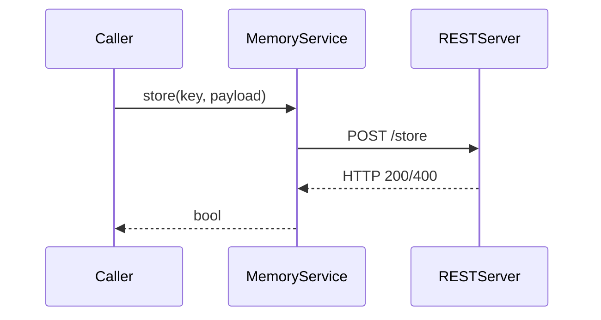
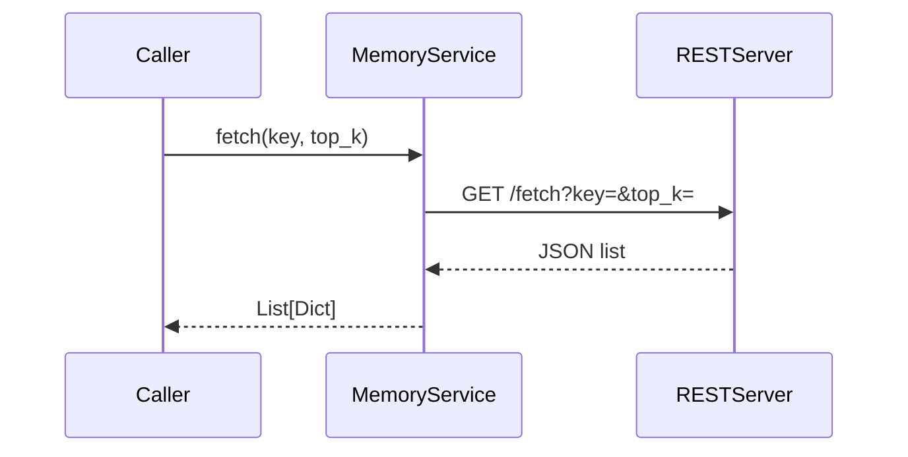

# Memory Service

The `MemoryService` component persists events so that agents can recall prior
context. The default implementation in `src/memory_service.py` is a thin REST
client. It expects a server exposing `/store` and `/fetch` endpoints and simply
forwards requests using `requests`.

## Implementation overview

```python
class MemoryService:
    def __init__(self, endpoint: str):
        self.endpoint = endpoint

    def store(self, key: str, payload: Dict[str, Any]) -> bool:
        response = requests.post(f"{self.endpoint}/store",
                                 json={"key": key, "data": payload})
        return response.ok

    def fetch(self, key: str, top_k: int = 5) -> List[Dict[str, Any]]:
        response = requests.get(f"{self.endpoint}/fetch",
                                params={"key": key, "top_k": top_k})
        return response.json() if response.ok else []
```

The service makes no attempt to embed or rank data—it simply passes the payload
through to whatever backend you provide.

## Sequence diagrams

### `store()`



### `fetch()`



## Swapping backends

You can replace the REST service with a vector database or any other storage
layer. Two common approaches are:

1. **Implement a new MemoryService** that directly calls the database library.
   Keep the `store()` and `fetch()` signatures so orchestrators remain
   compatible.
2. **Wrap your database with a small REST API** and point the existing client to
   the new URL. This keeps the Python code unchanged while allowing the backend
   to perform embedding, similarity search or other advanced logic.

Whichever method you choose, as long as `store()` saves payloads and `fetch()`
returns a ranked list of dictionaries, the orchestrators will work without
further modification.
