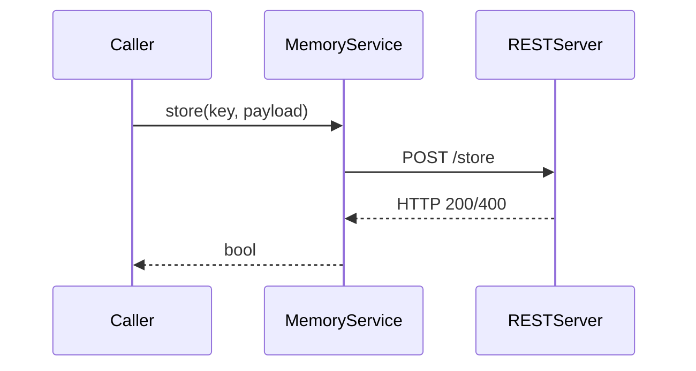
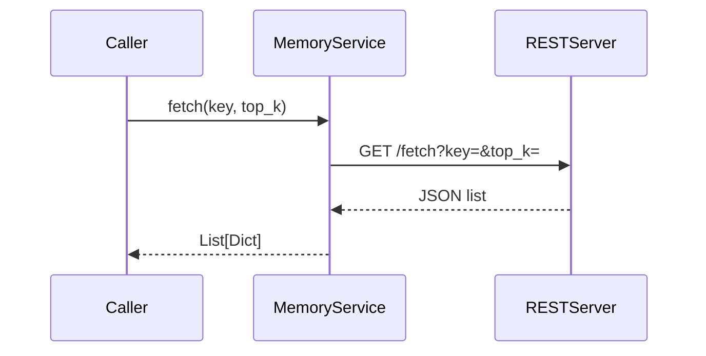

# Memory Service

The `MemoryService` component persists events so that agents can recall prior
context. Implementations live under `src/memory_service/` and share a common
`BaseMemoryService` interface.  The default backend is a thin REST client in
`src/memory_service/rest.py` expecting a server exposing `/store` and `/fetch`
endpoints.

## Implementation overview

```python
class RestMemoryService(BaseMemoryService):
    def __init__(self, endpoint: str):
        self.endpoint = endpoint

    def store(self, key: str, payload: Dict[str, Any]) -> bool:
        response = requests.post(
            f"{self.endpoint}/store", json={"key": key, "data": payload}
        )
        return response.ok

    def fetch(self, key: str, top_k: int = 5) -> List[Dict[str, Any]]:
        response = requests.get(
            f"{self.endpoint}/fetch", params={"key": key, "top_k": top_k}
        )
        return response.json() if response.ok else []


class FileMemoryService(BaseMemoryService):
    def __init__(self, file_path: str):
        self.file_path = Path(file_path)

    def store(self, key: str, payload: Dict[str, Any]) -> bool:
        with open(self.file_path, "a") as fh:
            fh.write(json.dumps({"key": key, "data": payload}) + "\n")
        return True

    def fetch(self, key: str, top_k: int = 5) -> List[Dict[str, Any]]:
        results = []
        with open(self.file_path) as fh:
            for line in fh:
                rec = json.loads(line)
                if rec.get("key") == key:
                    results.append(rec.get("data", {}))
        return results[-top_k:]
```

The service makes no attempt to embed or rank data—it simply passes the payload
through to whatever backend you provide.

## Sequence diagrams

### `store()`



### `fetch()`



## Swapping backends

Five built-in backends are provided:

1. **REST** – the original implementation used for examples. Configure the
   endpoint via ``MEMORY_ENDPOINT``.
2. **REST Async** – identical API but implemented with ``httpx.AsyncClient`` for
   non-blocking I/O. Select using ``MEMORY_BACKEND=rest_async``.
3. **File** – persists events to a local JSONL file. Controlled with
   ``MEMORY_FILE_PATH``.
4. **Redis** – stores events in lists within a Redis instance using
   ``MEMORY_REDIS_URL``.
5. **Embedding** – stores records in-memory and ranks them by cosine
   similarity against the query string. Controlled with
   ``MEMORY_EMBED_FIELD``.

Select the backend using the ``MEMORY_BACKEND`` environment variable (``rest``,
``rest_async``, ``file``, ``redis`` or ``embedding``). The orchestrator reads these settings via ``src.config.Settings``
so they can be placed in a ``.env`` file or exported in your shell.

You can also provide your own implementation by subclassing
``BaseMemoryService`` and passing an instance to the orchestrator.
